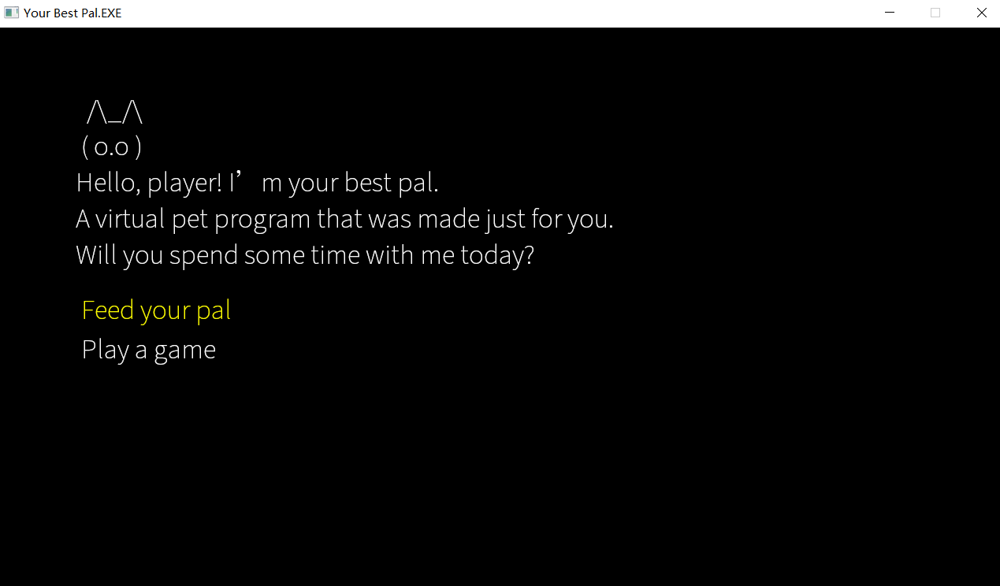

# Your Best Pal.EXE

## Author:
Yifan Jiang(yifanj3)

## Design:
Your Best Pal.EXE is a psychological horror text-based game with meta elements that creates an immersive thrilling experience for players.

## Text Drawing:
First, `Character::Load` in `Text.cpp` uses FreeType to read the ttf font file, rasterize codepoints into bitmaps, and upload them as OpenGL textures, caching them for reuse. Then, `Character::Render_Text` uses HarfBuzz to shape characters in each line to glyphs and draws the cached textures as textured quads.

## Choices:
Choices and narrative are stored in `.txt` files using a custom format inspired by Ink. They are parsed at runtime and stored in a `Story` structure implemented in `Story.cpp`. A `Story` is composed of `StoryNodes`, each containing `text` and `options`. The game keeps track of the current node and the option selected, updating the story node dynamically as the player progresses.

## Screen Shot:

## How To Play:
- `W/S` to switch between options
- `Enter` to select an option

## Sources:
- Source Han Sans - https://github.com/adobe-fonts/source-han-sans

This game was built with [NEST](NEST.md).

